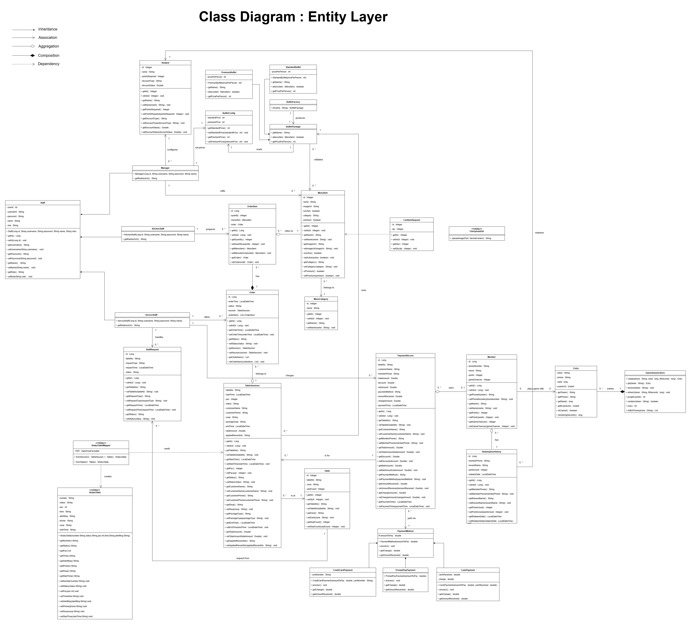
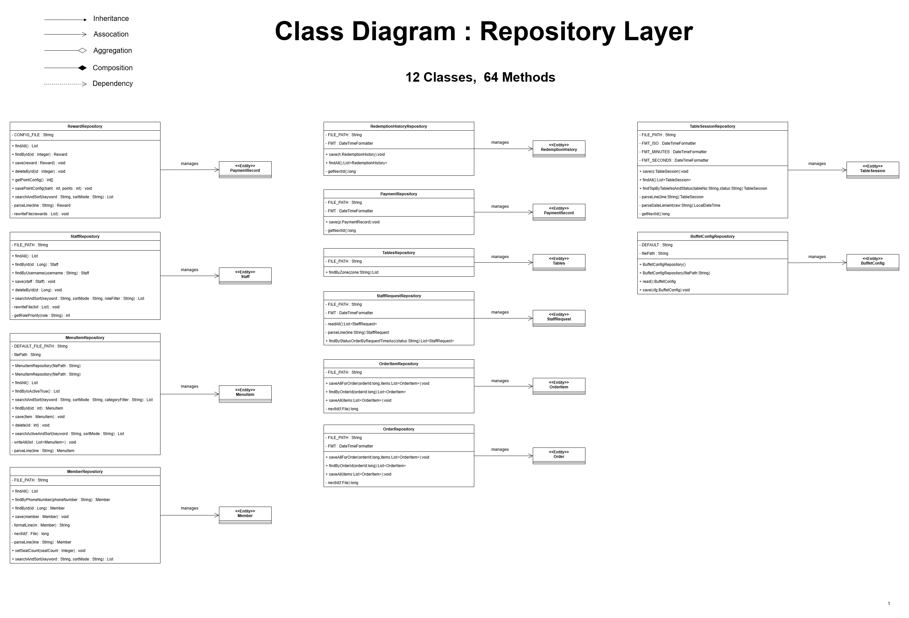
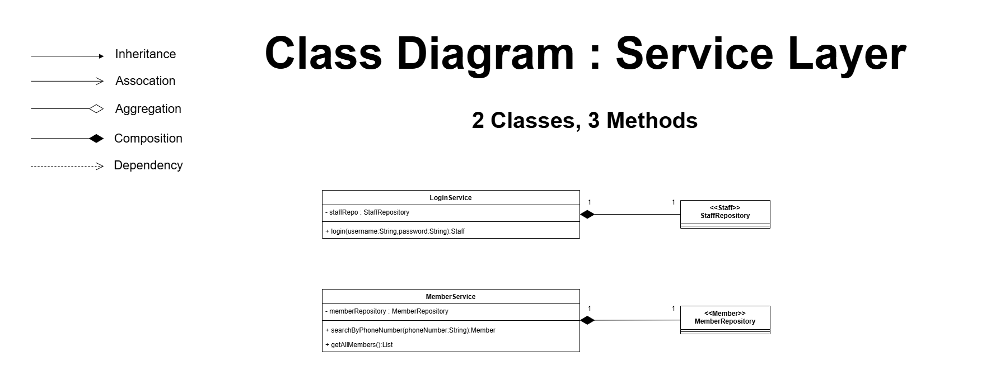
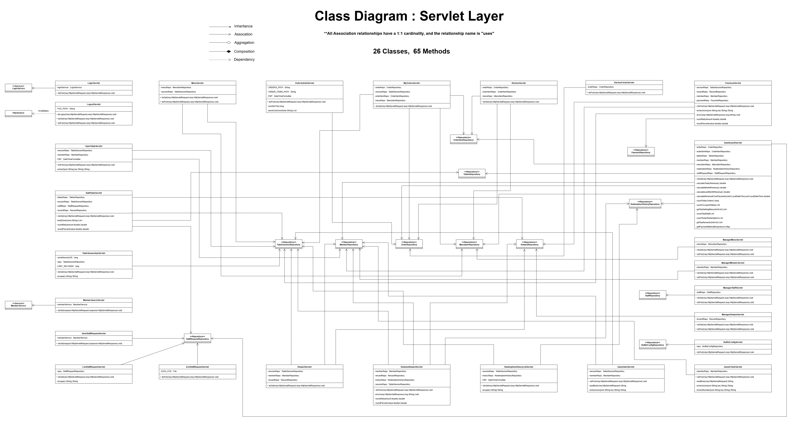

# SUT Shabu Management System

A comprehensive web-based restaurant management application developed as a core project for the **PROJECT IN OBJECT-ORIENTED PROGRAMMING AND DATA STRUCTURES** course. This system streamlines order workflows between customers and kitchen staff, while enhancing the dining experience through an integrated gamification module.

## Key Features

*   **Customer Tablet Interface:** A responsive, intuitive web interface designed for customers to browse menus and place orders directly from their tables.
*   **Kitchen Monitor:** A dedicated real-time dashboard for kitchen staff to manage, track, and fulfill order tickets efficiently.
*   **Gamification Module:** An interactive loyalty system that allows customers to earn points and play mini-games, boosting engagement and customer retention.
*   **Role-Based Access Control:** Distinct operational interfaces tailored for Service Staff, Kitchen Staff, and Managers.

## Technologies Used

*   **Language:** Java (JSP / Servlet)
*   **Server:** Apache Tomcat
*   **Frontend:** HTML5, CSS3, JavaScript
*   **Database:** Flat-file Storage (Text-based)

## Language Support
* **System Language:** The user interface of this web application is currently fully implemented in **Thai**.

## System Architecture (Class Entities)

This project is built upon solid OOP principles including Encapsulation, Inheritance, and efficient Data Flow.

## Getting Started

### Prerequisites
*   Operating System: Windows
*   Java Runtime Environment (JRE) / JDK (Recommended: 17+)
*   Web Browser: Google Chrome or Microsoft Edge

### How to Run
1.  Navigate to the `portable-server` folder.
2.  Double-click the `start.bat` file.
3.  Wait until the Command Prompt displays: **"[INFO] Starting Java..."**.
4.  Open your browser and visit: `http://localhost:8082/sut-shabu/`

## Login Credentials (for testing)
You can explore the system functionalities using the following credentials:

*   **Service Staff:** Username: `Staff` | Password: `7894`
*   **Kitchen Staff:** Username: `Kitchen` | Password: `7894`
*   **Manager:** Username: `Manager` | Password: `7894`

## Customer Access

To view the ordering interface for a specific table, use the following URL format:
`http://localhost:8082/sut-shabu/menu?tableNo=[TableNumber]`

*(Example for Table A1: http://localhost:8082/sut-shabu/menu?tableNo=A1)*

## Important Notes

*   **Do not close** or terminate the Command Prompt window while the server is running.
*   Ensure that Port 8082 is not currently in use by other applications.
*   The system will automatically configure the Java environment upon the first run if not already installed.

---
*Developed as part of the PROJECT IN OBJECT-ORIENTED PROGRAMMING AND DATA STRUCTURES course.*
